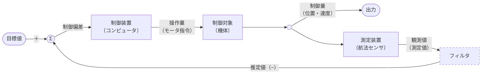

# CanSat 競技 計測と評価の細則

2024 年 8 月 7 日 種子島ロケットコンテスト技術部会

# 1. 停止判定
 * 種目５（自律制御カムバック） 
ゴールは自律的に判断して停止すること。例えば機体から音や光や旗などを出すなど、客観的に分かるのが望ましい。競技者が口頭で宣言する場合は、あとで制御ログから確認できること。 ゴールの範囲は定めないので、必ずしもゴールに近くなくとも、これ以上近づけないと自律的に判断して停止してもよい。
 * 種目６（遠隔制御カムバック） 
ゴールは競技者が口頭で宣言する。ゴールの範囲は定めないので、必ずしもゴールに近くなくとも、これ以上近づけないと自律的にまたは操縦者が判断して停止してもよい。

* 種目７（オリジナルミッション） 
ミッション完了は競技者が口頭で宣言する。

* 各種目共通 
CanSat が正常に動作せず、ゴールないしミッション完了の見込みがないとき、ギブアップとする。ギブアップは審査員が勧告、競技者が口頭で宣言、または投下から 20 分とし、CanSat が稼働中であれば速やかに停止させる。ギブアップ申告でも測距と計時は行うが、ポイントや順位はつけない。ギブアップでも特別賞の対象にはなる。

# 2. 時間計測
 * 時間は投下装置が開いてから、ゴール判定またはギブアップまでを分秒単位で計測する。
 * 投下装置が開いてから落ちるまで時間がかかる場合も、機体設計の責任なので時計は進める。 
 * 種目７では不要だが希望があれば計測する。

# 3. 距離計測 
* ゴール（ロードコーン）の中心から、機体の最遠部までを計測する。
  * 機体が複数ある場合は、最も近い機体の最遠部。
  * 連結した機体や、引きずっているものがある場合は、その一体化した物の最遠部。

* 10m 以上はレーザー距離計で 0.1m 精度、10m 未満は巻尺で 0.01m 精度で計測する。
* 種目７では不要だが希望があれば計測する。

# 4. ポイント計算
種目５では距離 𝑅 を m 単位、時間 𝑇 を秒単位で、10/R - T/60 をポイントとする。  
制御履歴で正常な制御が確認できたものに対して、ポイントの高いものから順位をつける。 
種目６では距離のみで順位をつけ、同距離の場合は挑戦した制御の難度で優劣をつける。

## 補足：趣旨説明

ポイントを距離に反比例とすることにより、ゴール近傍のハイレベルな制御への挑戦に配点を高くしている。コーンに接してゴールした場合は、小さい機体ほど高得点になることで、小型化の挑戦を促すことも期待している。時間については意図的に短時間でゴール判定しても効果が小さいように、時間比例の減点とした。高精度タイプは所用時間 10 分で距離 1m、標準型が 5 分で 2m、高速型は 1 分で10m が達成目標と想定して、±0 点になるよう設定した。ポイントの評価方法は実施状況をみて、次回以降に改訂がありうる。

# 5. 制御履歴とは

種目５（自律制御カムバック）で提出を要求している制御履歴とは、**センサで計測した位置・速度の時系列データだけでなく、モータ等への制御指令の履歴も含むこと**。制御工学の用語として、 前者を航法データまたは観測値とも呼び、制御したい物理量である制御量（真値）を測定したものである。必要に応じてフィルタ処理などを行った推定値を用いる。後者を操作量と呼び、直接操作できる物理量である。航法データのみ記録しているチームが散見されるが、それでは偶然ゴールに向かっているのと区別できない。操作量の記録と照らし合わせることで、方向転換や直進などがゴールに向かって合理的になされているかの証となる。また、車輪の破損やスタックなどで指令通りの移動をしていなくても、操作量の記録があれば、制御指令までは正常になされていたとして、部分点の評価ができる。

一般的なフィードバック制御のブロック線図（括弧内は CanSat の典型例）
